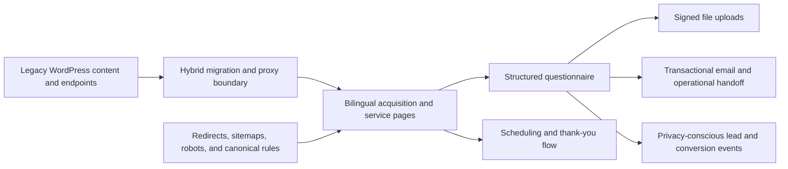

# SIAMO Digital Customer & Lead System

A bilingual digital customer journey for an interior design business, built to connect service positioning, acquisition, qualification, file collection, scheduling, analytics, and operational handoff.

[Visit the live experience](https://siamodesign.com)

## Context

SIAMO had an aging WordPress website and an opportunity to evolve beyond a traditional full-service interior design model. The business needed a clearer service structure, a credible bilingual experience, a way to qualify prospective clients, and a migration path that would not discard existing search visibility or content infrastructure.

My work began with business discovery rather than a predetermined technology. I benchmarked the market, identified virtual interior design as a potentially more scalable service direction, incorporated that service into the customer journey, and implemented the resulting system in Next.js while preserving necessary WordPress and SEO continuity.

## My responsibility

As an independent freelance and consulting contributor, I worked across strategy, product definition, design, implementation, and production delivery:

- Benchmarked competitors and translated the findings into a new virtual interior design service direction.
- Redesigned the public experience around the services and decisions prospective clients actually need to understand.
- Built English and Spanish acquisition, service, portfolio, intake, and thank-you journeys.
- Designed the questionnaire workflow, file collection, transactional email, analytics, and operational handoff.
- Planned an SEO-conscious migration from the previous WordPress implementation.
- Maintained a hybrid boundary for legacy WordPress capabilities that could not be retired immediately.

## The system



### Customer-facing experience

- English and Spanish routes for services, portfolios, company information, and conversion flows.
- Separate full-service and virtual-design journeys.
- Responsive, content-rich project presentations and service explanations.
- Questionnaire and scheduling flows designed to move visitors toward a useful business conversation.

### Lead intake and operational handoff

- Structured project questionnaire rather than a generic contact form.
- Server-generated submission identifiers for traceability.
- Signed Supabase upload URLs for plans, references, and supporting files.
- Server-side validation, storage coordination, and transactional email delivery.
- Time-limited signed file access in the internal email handoff.

### Analytics and data boundaries

- First-party events for landing views, meaningful CTA actions, questionnaire activity, and scheduling signals.
- Session and visitor identifiers used to connect acquisition activity with accepted lead submissions.
- Personally identifiable questionnaire fields excluded from analytics payloads.
- Normalized email hashing used selectively for audit joins without sending the raw address into analytics.
- Analytics failures are isolated so they do not block a valid customer submission.

### SEO-conscious migration

- Explicit redirect rules for legacy WordPress, multilingual, portfolio, service, and author URLs.
- Separate sitemap and robots behavior for the new experience and retained legacy surfaces.
- No-index and no-cache policies for questionnaires, thank-you pages, and transactional endpoints.
- Hybrid proxying and hostname rewriting for WordPress functionality that remained necessary during migration.
- Protection against duplicate or broken public paths while the new and old systems coexisted.

## Key product and technical decisions

### Treat the website as a business system

The public site was designed as the beginning of a workflow: explain the offer, help a prospect select the right service, collect the information required for qualification, gather relevant files, preserve acquisition context, and hand the opportunity to a human.

### Introduce a scalable service without removing human judgment

Collection, validation, uploads, event capture, and transactional communication are automated. Consultation, qualification, creative direction, commercial decisions, and project delivery remain human responsibilities.

### Migrate incrementally

Replacing every WordPress dependency at once would have introduced unnecessary search and operating risk. The architecture allowed the new Next.js experience and selected legacy capabilities to coexist behind controlled routes while redirects and public URLs were normalized.

### Keep conversion measurement from breaking conversion

Analytics calls are treated as supporting evidence, not as a dependency for accepting an inquiry. The submission flow remains resilient if the measurement service is unavailable.

## Technology

- Next.js 16 App Router
- React 19 and TypeScript
- Supabase Storage and signed URLs
- Nodemailer and SMTP
- Server-side APIs and event submission
- WordPress proxy and legacy-route integration
- Bilingual routing
- SEO redirects, sitemaps, robots directives, and cache controls
- Vercel deployment

## Local development

```bash
npm install
npm run dev
```

Copy `.env.example` into a local environment file and supply your own development credentials. The repository does not include production secrets.

```text
SUPABASE_URL
SUPABASE_SERVICE_ROLE_KEY
SUPABASE_BUCKET
SMTP_HOST
SMTP_USER
SMTP_PASS
SMTP_FROM
QUESTIONNAIRE_TO
NEXT_PUBLIC_INSIGHTS_API_KEY
INSIGHTS_SERVER_API_KEY
```

## Evidence and claim boundaries

The repository directly demonstrates the routes, integrations, data handling, lead workflow, analytics instrumentation, migration rules, and production-oriented SEO controls described above.

No claim is made about conversion lift, lead volume, revenue, or time saved because a validated historical baseline and complete commercial measurement record are not available.

## What this project demonstrates

- Translating market research into a digital service and customer journey
- Connecting acquisition with qualification and operational handoff
- Full-stack implementation across pages, APIs, storage, email, and analytics
- Bilingual product delivery
- SEO-aware modernization of a live legacy system
- Privacy-conscious event and lead design
- Incremental migration and integration judgment
- Ownership from ambiguous business opportunity through production

---

**Gabriel Scipione**  
Business Systems & Solutions Builder  
[GitHub profile](https://github.com/gfscipione) · [LinkedIn](https://www.linkedin.com/in/gabrielscipione) · [Elevator Lab](https://donebyelevator.com)

